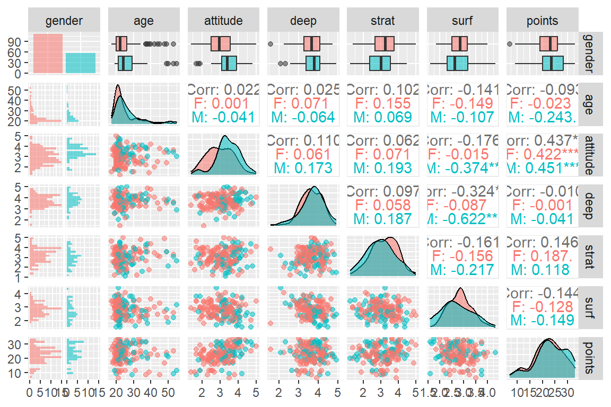

***

# Introduction to Open Data Science - Course Project


# About the project

*After completing this course you will understand the principles and advantages of using open research tools with open data and understand the possibilities of reproducible research. You will know how to use R, RStudio, RMarkdown, and GitHub for these tasks and also know how to learn more of these open software tools. You will also know how to apply certain statistical methods of data science, that is, data-driven statistics.*

GitHub Repository: <https://github.com/emilia-2022/IODS-project.git>

## Reflection 1


```r
date()
```

```
## [1] "Tue Nov 15 00:24:06 2022"
```

*Open the file chapter1.Rmd located in your IODS-project folder with **RStudio**. Just write some of your thoughts about this course freely in the file, e.g., How are you feeling right now? What do you expect to learn? Where did you hear about the course?*

Currently, I am feeling a little overwhelmed as I have never worked with Github and had some technical issues while setting up the course templates. I also have very little experience with R and my first time working with it was during a course last period. So, overall I feel a bit overwhelmed but trying to stay positive!

Having heard about the course through our social data science teacher tutor, I expect to learn more about the world of open data science. I also hope to learn how to effectively use Github to improve my workflow and implement version control in my future projects. \
\
*Also reflect on your learning experiences with the **R for Health Data Science** book and the **Exercise Set 1**:How did it work as a "crash course" on modern R tools and using RStudio? Which were your favorite topics? Which topics were most difficult? Some other comments on the book and our new approach of
getting started with R Markdown etc.?*

I found that Exercise Set 1 worked well as a crash course for R. It was also similar to the course material presented in my previous R course which helped me understand the content more clearly. I find the book to be well written and all the comments in the provided R code really help my learning! However, it is a lot of material to cover in a week if you are not familiar with R and R Markdown.

One of the concepts I still struggle with is long versus wide data formats. It was briefly touched on during a previous course but I am still not sure how and when to apply it in my own work. Another concept I still struggle to interpret clearly is the residual graphs. I understand - in theory - what they are supposed to look like but I find it hard to interpret them when they differ from the perfect model.

My favourite topics were located under *Chapter 4: Different types of plots.* I really enjoy how versatile R is and how many ways there are to work data visualizations. I especially liked how you are able to customize your plots using various commands in R.
  
***
  

# Week 2 - Linear Regression

This week I have worked with linear regression. Despite having worked
with linear regression extensively in a previous course, I still learned
new coding tips and tricks from the exercise code. A great example of
that was being to add new code lines on top of an old plot using
new_plot \<- old_plot + new code syntax. I struggle with interpretations
of the output, but I have tried hard to interpret the results in the way
I understand them!


```r
date()
```

```
## [1] "Tue Nov 15 00:24:06 2022"
```


# Assignment 2: Linear Regression

## Reading in the Data

### Relevant Libraries and Packages


```r
library(tidyverse)
library(dplyr)
library(ggplot2) 
library(GGally)            
library(purrr)
```

### Step 1: Reading in the data


```r
# set working directory to access data
setwd("C:\\Users\\Emilia\\Documents\\Uni Helsinki\\Year One\\Teaching Period 2\\Open Data Science\\IODS-project_2022\\data")

# read data from previously wrangled file 
students_learning2014 <- read.csv("learning_2014.csv", sep = ",", header = TRUE)
```


```r
dim(students_learning2014)
```

```
## [1] 166   8
```

```r
str(students_learning2014)
```

```
## 'data.frame':	166 obs. of  8 variables:
##  $ X       : int  1 2 3 4 5 6 7 8 9 10 ...
##  $ gender  : chr  "F" "M" "F" "M" ...
##  $ age     : int  53 55 49 53 49 38 50 37 37 42 ...
##  $ attitude: num  3.7 3.1 2.5 3.5 3.7 3.8 3.5 2.9 3.8 2.1 ...
##  $ deep    : num  3.58 2.92 3.5 3.5 3.67 ...
##  $ strat   : num  3.38 2.75 3.62 3.12 3.62 ...
##  $ surf    : num  2.58 3.17 2.25 2.25 2.83 ...
##  $ points  : int  25 12 24 10 22 21 21 31 24 26 ...
```

*Explanations*

This data set consists of information on 7 variables (X is merely an ID
variable) collected on 166 students. Data was collected from 2014-2015
and the variables selected for this dataset focus on various ways of
learning employed by students, their attitude towards statistics, as
well as background information.

Below you can find a description of each variable present in the
dataset:

| Variable Name | Type             | Descriptor                                       |
|-----------------|-----------------|--------------------------------------|
| X             | Integer          | order of the variables (1-166)                   |
| Gender        | Character        | student's gender, either M or F                  |
| Age           | Integer          | student's age                                    |
| Attitude      | Numeric (double) | average of student's attitude towards statistics |
| Deep          | Numeric (double) | student's use of deep learning                   |
| Strat         | Numeric (double) | student's use of strategic learning              |
| Surf          | Numeric (double) | student's use of surface learning                |
| Points        | Integer          | student's exam score                             |

### Step 2: Preliminary Exploration

#### 2.1 Graphical Overview


```r
# Graphical Overview 
ggpairs(students_learning2014[-1],                   # data, excluding X
        mapping = aes(col = gender, alpha = 0.3), 
        lower = list(combo = wrap("facethist", bins = 20)))
```


#### 2.2 Summaries


```r
students_learning2014[-1]  %>%
  split(.$gender) %>%
  map(summary) 
```

```
## $F
##     gender               age           attitude          deep      
##  Length:110         Min.   :17.00   Min.   :1.400   Min.   :1.583  
##  Class :character   1st Qu.:20.00   1st Qu.:2.500   1st Qu.:3.271  
##  Mode  :character   Median :22.00   Median :2.950   Median :3.667  
##                     Mean   :24.85   Mean   :2.990   Mean   :3.657  
##                     3rd Qu.:26.00   3rd Qu.:3.575   3rd Qu.:4.083  
##                     Max.   :53.00   Max.   :5.000   Max.   :4.750  
##      strat            surf           points     
##  Min.   :1.375   Min.   :1.833   Min.   : 7.00  
##  1st Qu.:2.656   1st Qu.:2.500   1st Qu.:19.00  
##  Median :3.250   Median :2.833   Median :23.00  
##  Mean   :3.201   Mean   :2.830   Mean   :22.33  
##  3rd Qu.:3.750   3rd Qu.:3.146   3rd Qu.:26.00  
##  Max.   :5.000   Max.   :4.000   Max.   :33.00  
## 
## $M
##     gender               age          attitude          deep      
##  Length:56          Min.   :19.0   Min.   :1.700   Min.   :2.083  
##  Class :character   1st Qu.:21.0   1st Qu.:3.100   1st Qu.:3.396  
##  Mode  :character   Median :24.0   Median :3.400   Median :3.792  
##                     Mean   :26.8   Mean   :3.443   Mean   :3.725  
##                     3rd Qu.:29.0   3rd Qu.:3.900   3rd Qu.:4.083  
##                     Max.   :55.0   Max.   :4.800   Max.   :4.917  
##      strat            surf           points     
##  Min.   :1.250   Min.   :1.583   Min.   : 9.00  
##  1st Qu.:2.375   1st Qu.:2.312   1st Qu.:20.00  
##  Median :3.000   Median :2.625   Median :23.50  
##  Mean   :2.964   Mean   :2.704   Mean   :23.48  
##  3rd Qu.:3.531   3rd Qu.:3.167   3rd Qu.:28.25  
##  Max.   :4.500   Max.   :4.333   Max.   :33.00
```

*Interpretations*

From the graphical representation we can see their frequency,
distributions, scatter plot, and correlations for each variable. Data
from female students is shaded in pink and data from male students is
shaded in light blue. Each variable will be interpreted in more detail
below:

**Gender**

Frequency data reveals that the majority of respondents are female, with
110 respondents being female and 56 being male. There seems to be little
correlation between gender and the other variables. Little is revealed
from the scatter plots.

**Age**

Age is a variable which shows a highly skewed distribution with the
majority of respondents being of a younger age. This is confirmed in the
summary with the mean age being around 25 years old. Younger age seems
to be characteristic irrespective of gender, although it seems that male
respondents have a less sharp distribution curve.

**Attitude**

Attitude possess the highest statistically significant correlation with
the variable points (representing exam scores). As the correlation is
positive and significant (0.437) for both males and females we can
interpret it as the more positive attitude one has towards statistics,
the higher one will perform on exams. It seems that male students have a
slightly more neutral/positive attitude towards statistics as exhibited
in the distribution curve. Female students, having a less sharp
distribution curve, are more neutral/neutral towards statistics with
extreme opinions (points on the tails of the distribution curves) being
infrequent, This is confirmed in the mean attitudes with males having a
mean of 3.443 and females having a mean of 2.990.

**Deep**

Deep has the second highest statistically significant correlation, with
males using surface learning. This is negative correlation meaning that
males who do surface learning are less likely to do deep learning. This
correlation is not significant for female students. Both genders have
similar means for deep learning meaning that males are only slightly
more likely to do deep learning than the other. As the means are higher
than the other learning types (3.657 for females, 3.725 for males), it
means that these students engage in deep learning more often than other
types of learning.

**Strat**

Strategic learning is the second highest type of learning used: in both
males and females (females mean 3.201, males 2.964). Contrasting deep
learning, it appears that female students use strategic learning more
than male students (as seen in the mean). No statistically significant
correlations are present, but the highest correlation is with age. It is
a positive correlation (0.102), meaning that those who are older use
strategic learning more often.

**Surf**

Surface learning has the third highest statistically significant
correlation with the variable attitude. Males are negatively correlated
(-0.374) meaning that male students who do surface learning are more
often have a negative attitude towards statistics. Compared to deep
learning and strategic learning, students appear to use surface learning
less (2.830 mean for females, 2.704 for males).

## Model Building 

#### Step 1: Initial Model 


```r
# create and fit regression model with three explanatory variables 
model <- lm(points ~ attitude + age + strat, data = students_learning2014)
summary(model)
```

```
## 
## Call:
## lm(formula = points ~ attitude + age + strat, data = students_learning2014)
## 
## Residuals:
##      Min       1Q   Median       3Q      Max 
## -18.1149  -3.2003   0.3303   3.4129  10.7599 
## 
## Coefficients:
##             Estimate Std. Error t value Pr(>|t|)    
## (Intercept) 10.89543    2.64834   4.114 6.17e-05 ***
## attitude     3.48077    0.56220   6.191 4.72e-09 ***
## age         -0.08822    0.05302  -1.664   0.0981 .  
## strat        1.00371    0.53434   1.878   0.0621 .  
## ---
## Signif. codes:  0 '***' 0.001 '**' 0.01 '*' 0.05 '.' 0.1 ' ' 1
## 
## Residual standard error: 5.26 on 162 degrees of freedom
## Multiple R-squared:  0.2182,	Adjusted R-squared:  0.2037 
## F-statistic: 15.07 on 3 and 162 DF,  p-value: 1.07e-08
```

*Interpretations*

From this model we can see that the combination of the three explanatory
variables can explain up to 20.37% of the variation in a student's exams
scores. While all these variables are significant, only attitude is
significant above the 99% threshold. Age and strategic learning are
significant with a 90% confidence interval with the p-values 0.0981 and
0.0621 respectively.

From the coefficients we can see that for every increase in a positive
attitude the students exam score will increase by 3.48077 points. For
age, as it is negative coefficient, for each increase in age the exam
points will decrease by -0.08822. Finally, for strategic learning, each
increase in use will result in 1.00371 increase in exam points.

This model's F-statistic has a low associated p-value at p= 1.07e-08.

#### Step 2: Re-Fitting the Model


```r
model2 <- lm(points ~ attitude, data = students_learning2014)
summary(model2)
```

```
## 
## Call:
## lm(formula = points ~ attitude, data = students_learning2014)
## 
## Residuals:
##      Min       1Q   Median       3Q      Max 
## -16.9763  -3.2119   0.4339   4.1534  10.6645 
## 
## Coefficients:
##             Estimate Std. Error t value Pr(>|t|)    
## (Intercept)  11.6372     1.8303   6.358 1.95e-09 ***
## attitude      3.5255     0.5674   6.214 4.12e-09 ***
## ---
## Signif. codes:  0 '***' 0.001 '**' 0.01 '*' 0.05 '.' 0.1 ' ' 1
## 
## Residual standard error: 5.32 on 164 degrees of freedom
## Multiple R-squared:  0.1906,	Adjusted R-squared:  0.1856 
## F-statistic: 38.61 on 1 and 164 DF,  p-value: 4.119e-09
```

*Interpretations*

If we remove the explanatory variables that are significant below a 95%
confidence threshold, we are left with the attitude variable. As seen in
the lower adjusted R-squared value (0.1865), this model has lower
predictive power than the previous model. Attitude can explain
approximately 18% of the variation in ones exam scores. An increase in
attitude still results in a slightly higher increase in exam points,
3.5255 compared to 3.48077, and the explanatory is still highly
significant at p = 4.12e-09.

#### Step 3: Model Diagnostics


```r
# place all four graphics in same plot
par(mfrow = c(2,2))
# draw diagnostic plots 
plot(model2, which = c(1,2,5))
```



*Interpretations*

From these diagnostics, it can be concluded that the final model is
fairly appropriate. The residuals vs fitted plot shows enough randomness
and does not appear to show and tunnel or curve patterns. The second
plot, normal Q-Q, also confirms the models' appropriateness as these is
little departure from linearity. For the final plot, Residuals vs
Leverage, it looks like no points are outside of Cook's distance meaning
that none of the outliers possess enough leverage or influence to
drastically change the model. However, the points 56 and 35 could be
investigated more closely as they are close.

***
